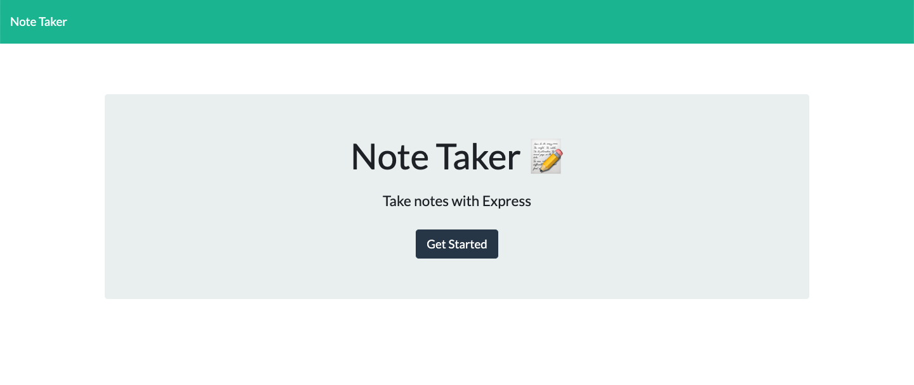
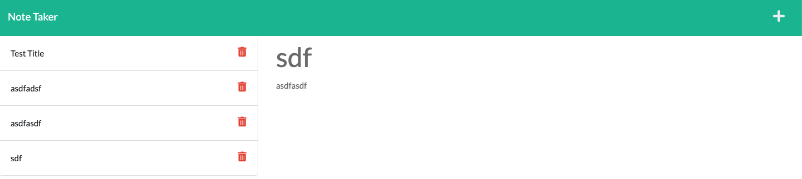
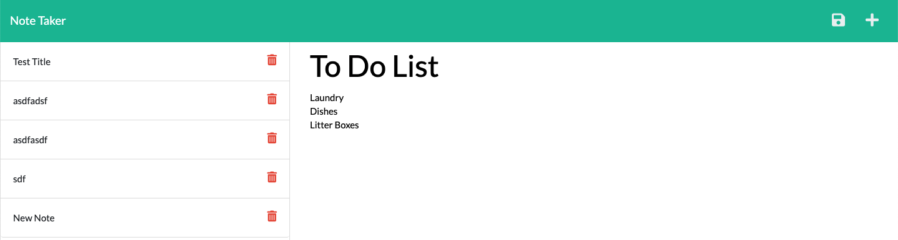

# Note Taker

## Project Description
We all have a million things going on and need a one stop place to keep track of activites. This app will allow the user to create multiple notes or to do lists making their lives more organized. While building this app I discovered that having accurtate file paths is crucial to functionality and had to work through many functionality issues because of incorrect paths. As well as the importance of server.js files for app functionality. 

To use the app for yourself [click here](https://boiling-reaches-05189.herokuapp.com/)

## Project Example 
To begin complying notes click "Get Started"

You will see notes already created in the left column. To create a new note click the "+" sign.

Begin typing new note. To save click the floppy disk icon. The note will then appear in the left column.

## Credits
Thank you to Google and my awesome tutor!
